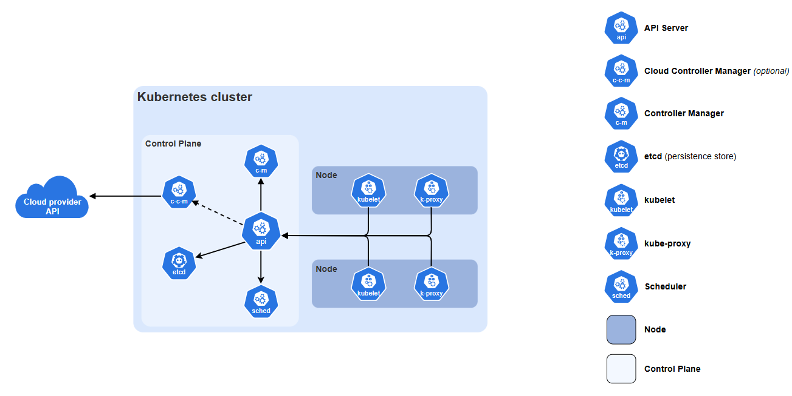

# Introduction

Welcome to **Pocket-Sized Kubernetes at Durham HPC Days 2026**! In this tutorial, you'll build a working Kubernetes cluster from scratch using Raspberry Pi hardware, deploy containerised applications, and gain experience working with distributed systems.

## Aims

By the end of the tutorial, you will have:

- A basic understanding of Kubernetes architecture and how it can be used in research computing
- Built a multi-node K3s cluster on Raspberry Pi hardware
- Deployed and managed basic containerised applications on Kubernetes
- Observed key Kubernetes features including self-healing and scaling
- Gained practical skills transferable to HPC and cloud environments

## Who We Are

This workshop is delivered by the **Cloud Native Special Interest Group** (SIG) with support from the **Computational Abilities Knowledge Exchange** (CAKE) partnership. We're a new community of research software engineers and technical professionals exploring cloud-native technologies in research software and digital infrastructure. You can find more about the SIG and how to get involved at [https://cloudnative-sig.ac.uk/](https://cloudnative-sig.ac.uk/).

## Following Along at Home

All code and resources used in this tutorial are available on the [tutorial's GitHub repository](https://github.com/cloud-native-sig/hpcdays26-pocket-sized-kubernetes). If you want to follow along at home or perhaps run your own workshop, you can start by reading our [extra reading section.](./extra-reading.md)

## Introduction to Kubernetes

### What is Kubernetes

Kubernetes (k8s) is an open-source container orchestration platform that automates deployment, scaling, and management of containerised applications across groups of machines.

### Kubernetes vs Docker Compose

**Docker** runs applications from built images in sandboxed environments called containers. **Docker Compose** is a declarative tool that allows you to run groups of containers with networking and storage volumes on a single host.

**Kubernetes** goes beyond Docker Compose by providing an orchestration pipeline for multi-host, multi-container applications. k8s allows complex containerised applications to run across multiple hosts in a cluster with powerful automation and management features.

!!! note "On Docker Swarm"
    Docker Engine's [Swarm mode](https://docs.docker.com/engine/swarm/) has many goals in common with Kubernetes, but is not as actively developed, feature-rich or has the same level of resilience for production use.

### Using Kubernetes in Research Computing

Developing a Kubernetes cluster is a good approach when you need to manage multiple containerised services across different machines, and may benefit from:

- Automatic scaling of workloads based on demand
- Rolling updates with minimal downtime
- Self-healing resilient systems with high-availability
- Portability between on-prem and cloud infrastructure

On the other hand, Kubernetes introduces complexity and has a significant learning curve, and so may not be appropriate for:

- Simple container applications that can run on a single host (use
  Docker Compose)
- HPC batch job management (use SLURM)
- Services offered by a cloud provider or technology you are already
  invested in
- Large-scale parallel filesystems (use dedicated solutions, e.g.,
  Lustre)

For more on this see, [our extra reading](./extra-reading.md) section on Kubernetes and HPC.

## Architecture Overview

Kubernetes follows a **control plane + worker nodes** architecture:

*The components of a Kubernetes cluster. [Overview Components](https://kubernetes.io/docs/concepts/overview/components/)*

### Key Components

- **Node**: A physical or virtual machine in the cluster
- **Pod**: The smallest deployable unit consisting of one more containers that share storage/network
- **Deployment**: Manages a set of identical pods (defines desired state)
- **Service**: Stable network endpoint to access pods 
- **Control Plane**: The brain of the cluster, makes decisions based on the current cluster state, accessible via the **API Server**
- **Worker Nodes**: Run the containerised applications using a
    container runtime, managed by a `kubelet` agent.

Other critical components include the Controller Manager and Scheduler
on the control node and `etcd`, a key-value store for cluster data.

### How it works

Kubernetes follows a *declarative* approach where you define the target state of the applications running in the cluster, and Kubernetes works continuously to achieve that state. For example, if a node goes down, Kubernetes may distribute its workload to other nodes to ensure services for running applications are not interrupted.Kubernetes management follows the Infrastructure as Code paradigm and is readily integrated with GitOps using high-level tools such as [ArgoCD](https://argoproj.github.io/cd/).

!!! tip "Further Reading"
    Further information on Kubernetes architecture can be found on our 
    [Introduction to Kubernetes workshop materials](https://cloud-native-sig.github.io/stfcfeb26-intro-to-kubernetes/).
