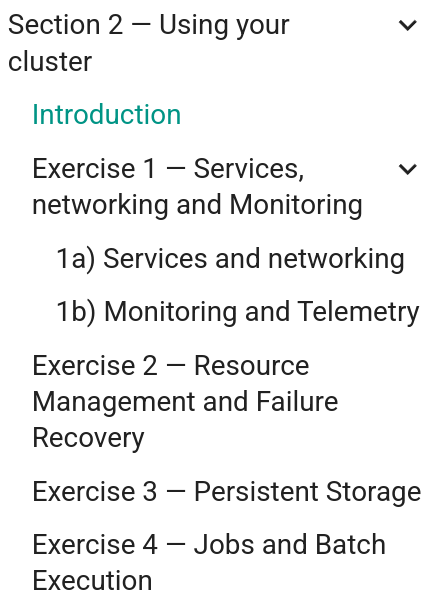

<br>

### Cloud-Native SIG and CAKE present...

# Pocket-Sized Kubernetes: Building and Deployment with Raspberry Pi Clusters

*16 June 2026, RH007, Durham University*

<p> <https://github.com/cloud-native-sig/hpcdays26-pocket-sized-kubernetes></img></p>
<p style="position:absolute; bottom:40px; right:45px; font-size:28px;"><a href="https://github.com/cloud-native-sig/hpcdays26-pocket-sized-kubernetes">github.com/cloud-native-sig/hpcdays26-pocket-sized-kubernetes</a></p>
<p style="position:absolute; bottom:15px; right:58px; font-size:28px;"><a href="https://cloud-native-sig.github.io/hpcdays26-pocket-sized-kubernetes">cloud-native-sig.github.io/hpcdays26-pocket-sized-kubernetes</a></p>

---

# Agenda

1. Introductions
1. Kubernetes Architecture & Cluster Design 
1. Section 1&mdash;Building your cluster <!--(Walkthrough)-->
1. Lunch break
1. Kubernetes Deployments & Namespaces
1. Section 2&mdash;Using your cluster <!--(Independent)-->
1. Summary, Q&A, Follow-up opportunities

---

<!-- _class: Title -->
<!-- _header: "" -->
# Introductions

---

## Who We Are

Tutorial from the **Cloud-Native Special Interest Group** with support from the **Computational Abilities Knowledge Exchange** partnership.

New community of RSEs/dRTPs for cloud-native technologies in research software and digital infrastructure.

<!--More about CN-SIG & getting involved at [https://cloudnative-sig.ac.uk/](https://cloudnative-sig.ac.uk/).-->
Get involved at [https://cloudnative-sig.ac.uk/](https://cloudnative-sig.ac.uk/)
<br>

**Lewis Sampson** (DAFNI), *<lewis.sampson@stfc.ac.uk>*
**Piper Fowler-Wright** (Rosalind Franklin Institute), *<piper.fowler-wright@rfi.ac.uk>*

---
<br>

## Today's Tutorial

By the end you will have:

- An understanding of Kubernetes architecture and its use in research computing
- Built a multi-node K3s cluster on Raspberry Pi hardware
- Deployed basic applications and observed key Kubernetes features
- Gained practical skills transferable to HPC and cloud environments

> <small>Everything you learn today can be used in your own work.</small>

#### Following Along at Home

<small> Code and resources available on the [GitHub repo](https://github.com/cloud-native-sig/hpcdays26-pocket-sized-kubernetes). If you want to recreate with your own hardware, see the [extra reading section](https://cloud-native-sig.github.io/hpcdays26-pocket-sized-kubernetes/extra-reading) of the GitHub pages.</small>

---

<!-- _class: Title -->
<!-- _header: "" -->
# Introduction to Kubernetes


---

## What is Kubernetes (k8s)

Kubernetes is an open-source container orchestration platform to automate the deployment, scaling & management of containerised applications across groups of machines.

---

# Kubernetes vs Docker Compose

* **Docker:** run apps from built images in containers (sandboxed environments)
* **Docker Compose:** groups of containers with networking and storage on a single host
* **Kubernetes:** Orchestration pipeline for multi-host, multi-container applications. 
<br>
<br>

---

# Kubernetes vs Docker Compose

- **Docker:** run apps from built images in containers (sandboxed environments)
- **Docker Compose:** groups of containers with networking and storage on a single host
- **Kubernetes:** Orchestration pipeline for multi-host, multi-container applications. 

<small>K8s allows complex containerised applications to run across multiple hosts in a cluster with powerful automation and management features.</small>

<!--
---

>Note On *Docker Swarm* - Docker Engine's [Swarm mode](https://docs.docker.com/engine/swarm/) has many goals in common with Kubernetes, but is not as actively developed, feature-rich or has the same level of resilience for production use.
-->

---

# Kubernetes in Research Computing

Use if need to manage multiple containerised services across different machines. Or may benefit from

- Automatic workload scaling based on demand
- Rolling updates with minimal downtime
- Self-healing resilient systems with high-availability
- Portability between on-prem and cloud infrastructure

---

# Kubernetes in Research Computing

Adds complexity and not typically suitable for:

- Simple container applications on a single host (use Docker Compose)
- HPC job management (use SLURM)
- Large-scale parallel filesystems (e.g., Lustre)
- Services offered by a cloud provider or technology you are already invested in
<br>

> <small>For more see the [extra reading section](https://cloud-native-sig.github.io/hpcdays26-pocket-sized-kubernetes/extra-reading) on Kubernetes and HPC</small>

---
<br>

# Architecture Overview

<figure style="text-align: center; margin-top:-10px; margin-bottom:-30px; padding-top:0px;">
  
  <figcaption><small>Components of a Kubernetes cluster (<a href="https://kubernetes.io">kubernetes.io</a>)</small></figcaption>
</figure>

---

# Key Components

- **Node**: Physical or virtual machine
- **Control Plane (Node)**: Brains of cluster, acts based on current cluster state vs target state
- **Worker Node**: Run containerised applications using a container runtime.
- **Pod**: Smallest deployable unit&mdash;one or more containers sharing storage/network
- **Deployment**: Target state of identical pods serving an app
- **Service**: Network endpoint for pods

<small>
Other critical components include the Controller Manager and Scheduler, and etcd (key-value store for cluster data).
</small>

---

# How Kubernetes Works

**Declarative:** define target state of applications&mdash;Kubernetes works to achieve it

Example: On *node failure* Kubernetes distributes workload to other nodes
<br>
<br>

---

# How Kubernetes Works

**Declarative:** define target state of applications&mdash;Kubernetes works to achieve it

Example: On *node failure* Kubernetes distributes workload to other nodes
<br>
<br>

<div style="position:absolute; bottom:220px;right:550px; border: 4px solid red;"><p style="margin:15px;">Reconciliation model</p></div>


---

# How Kubernetes Works

**Declarative:** define target state of applications&mdash;Kubernetes works to achieve it

Example: On *node failure* Kubernetes distributes workload to other nodes
<br>
<br>

<div style="position:absolute; bottom:220px;right:550px; border: 4px solid red;"><p style="margin:15px;">Reconciliation model</p></div>

<div style="position:absolute; bottom:120px; left:80px;">

> GitOps: Infrastructure as code (`.yaml`), workflow managers, e.g., [ArgoCD](https://argoproj.github.io/cd/)

</div>

---

<!-- _class: Title -->
<!-- _header: "" -->
# Designing a Cluster

---

# Kubernetes Distributions

- Vanilla k8s, i.e., [kubeadm](https://kubernetes.io/docs/reference/setup-tools/kubeadm/) (CNCF)&mdash;industry standard, fully-featured
- [RKE2](https://docs.rke2.io/) (Rancher Kubernetes Engine 2)&mdash;enterprise, security & compliance
- [K3s](https://k3s.io/) (Rancher)&mdash;Minimal resources & installation, e.g., IoT / Edge Computing
- [MicroK8s](https://canonical.com/microk8s) (Canonical)&mdash;Batteries included, lightweight
- [Minikube](https://minikube.sigs.k8s.io/docs/)&mdash;Single-node cluster for local development

---

# K3s and Hardware Requirements

K3s for our RPi clusters: minimal footprint & ease of installation

Control node&mdash;Min. 2 Cores/2G RAM
Worker node&mdash;Min. 1 Core/512M RAM
<br>

> In K3s, the node running the control-plane is referred to as the **Server**, and all other nodes **Agents**.

---

# Cluster Hardware

- 4x 4G RPi model 4B (or 400)
- RPi OS Lite (Debian-based, non-GUI)
- Select binaries and custom container images for air-gapped installations (see
  `workshop-setup/` on GitHub)

---

<!-- _class: Title -->
<!-- _header: "" -->
# Exercise 1—Connecting to Nodes

---

# Network Information

Each table should have a note with:

- RPi IP addresses
- SSH login credentials
- Router WiFi credentials

Connect your laptop to Router `TP-Link_AP_2A5A_01`
<br>

> <small> Our router does *not* provide internet access. Consider installing [kubectl](https://kubernetes.io/docs/tasks/tools/) locally first.</small>

---

# Verify Connectivity

Once connected to the router, as a group check access to each node:
```bash
ssh chef@192.168.x.xxx
hostname
exit
```
And that the worker nodes are reachable from the control:
```bash
ssh chef@192.168.x.xxx
ping -c3 192.168.x.yyy
```

---

## Troubleshooting

If a node is unreachable:

1. Check powered on
1. Check IP address
1. Check `sshd` is running
<br>

> <small>If needed, connect RPi to an external display to troubleshoot & configure IP using <code>nmcli/nmtui</code>.</small>

---
<br>

## Optional: Configure Host Aliases

<!--Consider adding IP-hostnames to `/etc/hosts/` on your device:-->
Edit `/etc/hosts` to use `ssh <user>@kmaster` etc. instead of IP addresses:
```text
192.168.x.xxx    kmaster
192.168.x.yyy    kworker1
```
<!--You can then use `ssh <username>@kmaster`, instead of having to remember all the IP addresses.-->
Or configure SSH aliases in <code>~/.ssh/config</code>: 
```text
Host kworker01
    HostName 192.168.x.yyy
    User chef
```
Then `ssh kworker01` would connect to the node. You can also setup SSH keys for quicker logins (e.g., `ssh-keygen -t ed25519; ssh-copy-id chef@kmaster`)

---


<!-- _class: Title -->
<!-- _header: "" -->
# Exercise 2—Installing K3s & Creating the Cluster

---

# Strategy

1. Install K3s on Control
2. Retrieve Join Token for Workers
2. Install K3s on Workers and Join to Cluster

Split into ~2 per node (pair program on one device)
<br>


> <small>Explore the [K3S Documentation](https://docs.k3s.io/) and ask questions!</small>

---

<br>

# Control Node Installation 

On `kmaster` (code on GitHub pages/slides):
<small>

```bash
sudo -i

chmod +x /root/k3s/k3s-arm64
cp /root/k3s/k3s-arm64 /usr/local/bin/k3s

mkdir -p /var/lib/rancher/k3s/agent/images/
cp /root/k3s/k3s-airgap-images-arm64.tar /var/lib/rancher/k3s/agent/images/

chmod +x /root/k3s/install.sh
INSTALL_K3S_SKIP_DOWNLOAD=true /root/k3s/install.sh
```

</small>

---

# Control Node Verification

Check K3s is running:
```bash
sudo systemctl status k3s
```
Check node status:
```bash
sudo kubectl get nodes
``` 
Which version of K3s was installed?

---

# Worker Node Join Token

Everyone on a worker node will need the following from the *control:*
```bash
sudo cat /var/lib/rancher/k3s/server/node-token
```
Copy this to, e.g., `/home/chef/node-token` on the Worker and assign
```bash
export CONTROL_NODE=192.168.x.xxx
export CONTROL_TOKEN=$(sudo cat /home/chef/node-token)
```

---

# Worker Installation

With `CONTROL_NODE` and `CONTROL_TOKEN` set (code on GitHub/slides):
<small>
```bash
sudo -i

chmod +x /root/k3s/k3s-arm64
cp /root/k3s/k3s-arm64 /usr/local/bin/k3s

mkdir -p /var/lib/rancher/k3s/agent/images/
cp /root/k3s/k3s-airgap-images-arm64.tar /var/lib/rancher/k3s/agent/images/

chmod +x /root/k3s/install.sh \
  INSTALL_K3S_SKIP_DOWNLOAD=true \
  K3S_URL=https://$CONTROL_NODE:6443 \
  K3S_TOKEN=$CONTROL_TOKEN \
  /root/k3s/install.sh
```
</small>

---

# Worker Verification

As on the master, check `sudo kubectl get nodes`. All nodes should have `STATUS: ready`  but no role (see [snippet on GitHub pages](https://cloud-native-sig.github.io/hpcdays26-pocket-sized-kubernetes/lesson1/exercise2/#verify-the-cluster) to fix this).

## Optional: kubectl without sudo

It is convenient to set
```bash
sudo chmod 644 /etc/rancher/k3s/k3s.yaml
```
to use `kubectl` without `sudo`. 

---

<!-- _class: Title -->
<!-- _header: "" -->
# Exercise 3—Using kubectl

---

# Kubectl Syntax

Command-line interface for Kubernetes:
```bash
kubectl <command> <type> [name] [flags]
```
- `<command>`&mdash;action
- `<type>`&mdash;Kubernetes resource (nodes, pods, deployments etc.)
- `[name]`&mdash;optional resource name
- `[flags]`&mdash;optional parameters

---

## Optional: kubectl From Your Laptop (Requires kubectl!)

Copy K3s config from the control:
```bash
scp chef@kmaster:/etc/rancher/k3s/k3s.yaml ~/.kube/config-k3s
```
Edit `server`:
```bash
server: https://<control-node-ip>:6443
```
Set `KUBECONFIG`:
```bash
export KUBECONFIG=~/.kube/config-k3s
```

---

# About: Namespaces

Separate groups of cluster resources:
```bash
kubectl get namespaces
```
Can filter resources by namespace, e.g.,
```bash
kubectl get pods -n kube-system
```
Change default namespace from `default` (empty) to `kube-system`:
```bash
kubectl config set-context --current --namespace=kube-system
```

---

# Exploring Resources (kube-system)

Get resource (`pods`, `deployments`, `services`...):
```bash
kubectl get <item>
```
`get all` may be used to list everything within a namespace

Chose a pod to inspect further:
```bash
kubectl get <pod-name> -o yaml
kubectl describe pod <pod-name>
kubectl logs <pod-name>
```

> <small>Commands `edit`, `patch` and `apply` may used for deployments (next session)</small>

---

# Accessing Containers

`exec` can be used to run commands in a container (like docker) within a pod:
```bash
kubectl exec -it <pod-name> -- sh
```
See examples in the next session

---

# About: Storage

Pods are *ephemeral.* Storing data requires

- Persistent Volumes (PV) and Persistent Volume Claims (PVC), OR
- `ConfigMaps` for configuration data, e.g., environmental variables, CLI arguments
<br>

> <small>Examples of PV/PVC in next session; for `ConfigMaps` see [Updating with ConfigMaps](https://cloud-native-sig.github.io/stfcfeb26-intro-to-kubernetes/lesson3-config-maps/)</small>


---

# Section 1&mdash;Summary

So far:
- Introduced Kubernetes architecture (Declarative) and design (Control/Workers, Distributions)
- Built RPi Cluster with K3s
- Setup `kubectl` to inspect Kubernetes resources
<br>

Next: Using your cluster!

<!--(Deployments to explore networking and monitoring, resource management and recovering, storage and jobs)-->

---


<!-- _class: Title -->
<!-- _header: "" -->
# Section 2—Using Your Cluster


---

<br>

# Prep: Get Demo Deployments
Clone repository to your laptop if you haven't already:
<small> 
```bash
git clone https://github.com/cloud-native-sig/hpcdays26-pocket-sized-kubernetes
```

</small>

Reconnect to `TP-Link_AP_2A5A_01` and copy `resources` to your *node*:
```bash
scp -r resources/ chef@192.168.x.xxx:~/
```
<!--In following we assume `~/resources` location-->

Import custom images into Kubernetes:
```bash
sudo k3s ctr images import /root/workshop-images.tar
```
<!--</img>-->

---

# About: Deployments

- Defines target *state* of your app (which container images, how many replica pods to run them)
- Kubernetes works to reconcile actual state with this target
- Deployed from a `manifest.yaml` using `apply`:
```bash
kubectl apply -f manifest.yaml
```

Kubernetes handles the rest!

<br>

> <small> `kubectl rollout restart deployment/deployment-name` can be used to initiate a *rolling restart* of a deployment if needed </small>

--- 

<h1 style="position:absolute;top:115px;left:60px;">Exercises: Over to You!</h1>

</img>
</img>

<div style="position:absolute;left:550px;top:300px;width:600px;border:2px solid #cc0000;border-radius:6px;padding:12px;">

**Tips**

&#x2022; Can be done in any order
&#x2022; Work on *different* exercises in pairs
&#x2022; Use namespaces and cleanup resources (see Exercises)

</div>

---

# Section 2&mdash;Summary

- Application *deployments* are specified by manifest files
- Services provide networking endpoints
- Examples with networking & monitoring, resource management & recovery, storage & jobs
<br>

> <small>Feel free to continue working on the exercises at home (e.g., using Minikube)</small>

---

# Knowledge Exchange opportunities

## Cloud_Native SIG

This workshop was brought to you by the Cloud-Native SIG and CAKE, with support from the Software Sustainability Institute

&nbsp;&nbsp;&nbsp;**Join us:**

- ✉️  [cloudnative-sig@jiscmail.ac.uk](https://www.jiscmail.ac.uk/cgi-bin/wa-jisc.exe?SUBED1=CLOUDNATIVE-SIG) 
- 🌐 [cloudnative-sig.ac.uk](https://cloudnative-sig.ac.uk)


---

# Knowledge Exchange Opportunities

### CAKE Fellowship

Read more: <https://www.cake.ac.uk/ke-fellowships/cohort1>
<br>

### SCD Kubernetes collaboration group

Contact Lewis <lewis.sampson@stfc.ac.uk> for more information.

---

<!-- _class: Title -->
<!-- _header: "" -->
# Thank you for your participation
